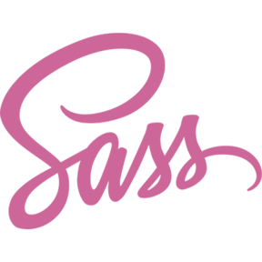

### Hi there 
 

I'm Thales Ludwig, Senior Web Engineer. UI/UX lover, gamer, and enthusiast for remote lifestyle. I am an always-learning machine that converts energy-drinks into scalable Javascript code.

- ❤️  Currently working with React
- 🌱  Also coding in Angular, Vue, Node and React Native
- 😄  Working remotely! 
- 🎮  Aspiring Game Developer
  

### 📫  How to reach me
 

- E-mail: thales.ludwig@gmail.com
  

### ⭐  Languages and Tools
 

  
  
  
  
  
  
  
  
  
  
  
  
  

### 💜  Support

Want to support my work or ask for something?
-  [Buy me a coffee](https://www.buymeacoffee.com/thalesludwig)
